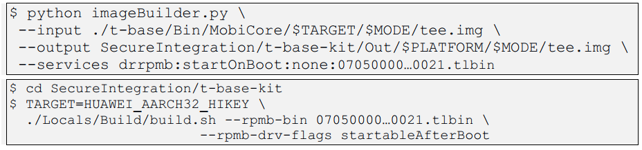

## Trustonic TEE、TSP(Trusted Secured Platform)介绍？

[点击此处-Trustonic Trusted Execution Environment - youtube视频](https://www.youtube.com/watch?v=K7M63z0vCm0)

## TAP(Trustonic Application Protection)介绍？

[点击此处-Trustonic Application Protection (TAP) Overview - youtube视频](https://www.youtube.com/watch?v=Zh7jpH96wQ8&t=79s)

## 如何开启trustonic_tee？

MTK的代码中，已经默认集成了trustonic TEE. 开启Trustonic TEE只需打开下列4个仓库下的宏开关即可

**1、preloader**

(vendor\mediatek\proprietary\bootable\bootloader\preloader\custom\${PROJECT}\${PROJECT}.mk)

```c
MTK_TEE_SUPPORT = yes

TRUSTONIC_TEE_SUPPORT = yes

MICROTRUST_TEE_SUPPORT = no

MTK_GOOGLE_TRUSTY_SUPPORT = no

export MTK_TEE_SUPPORT TRUSTONIC_TEE_SUPPORT MICROTRUST_TEE_SUPPORT MTK_GOOGLE_TRUSTY_SUPPORT
```

**2、kernel**

(${KERNEL_VER}\arch\arm\configs\${PROJECT}_debug_defconfig)<br>
(${KERNEL_VER}\arch\arm\configs\${PROJECT}_defconfig)<br>
(${KERNEL_VER}\arch\arm64\configs\${PROJECT}_debug_defconfig)<br>
(${KERNEL_VER}\arch\arm64\configs\${PROJECT}_defconfig)<br>

```c
CONFIG_TRUSTONIC_TEE_SUPPORT=y

CONFIG_MTK_TEE_GP_SUPPORT=y 
```

**3、projectConfig**

(device\mediatekprojects\${PROJECT}\ProjectConfig.mk)

```c
MTK_ATF_SUPPORT=yes

MTK_TEE_SUPPORT=yes

TRUSTONIC_TEE_SUPPORT=yes

MTK_TEE_GP_SUPPORT=yes 
```

**4、trustzone**

(vendor\mediatek\proprietary\trustzone\custom\build\project\${PROJECT}.mk)

```c
MTK_ATF_SUPPORT=yes

MTK_TEE_SUPPORT=yes

TRUSTONIC_TEE_SUPPORT=yes

MTK_TEE_DRAM_SIZE=0x1740000（根据你自己的TA来调整）

500A
CONFIG_TEE=y 否则无法编译到gud driver
```

## 如何通过log确定trustonic tee启动OK？

## MTK平台上使用Trustonic TEE调试指纹的步骤？

## 如何使用Trustonic TEE SDK编译TA？

## 如何开启实体RPMB?

MTK代码中，默认使用虚拟RPMB(即persist分区)，如需开启实体RPMB，则需将drRpmb driver打包到tee.img中即可

将drRpmb driver打包到tee.img中有两种方法:



## 如何客制化googlekey？

[请参考csdn的这篇博客](https://blog.csdn.net/weixin_42135087/article/details/106761192)

## googlekey安装失败了怎么办？

请确保EKKB_PUB和PKB已修改你们自己的数组。路径:
> vendor/mediatek/proprietary/trustzone/trustonic/source/bsp/common/500/t-sdk/TlSdk/Out/Bin/KeyReplace/test_key.cfg


